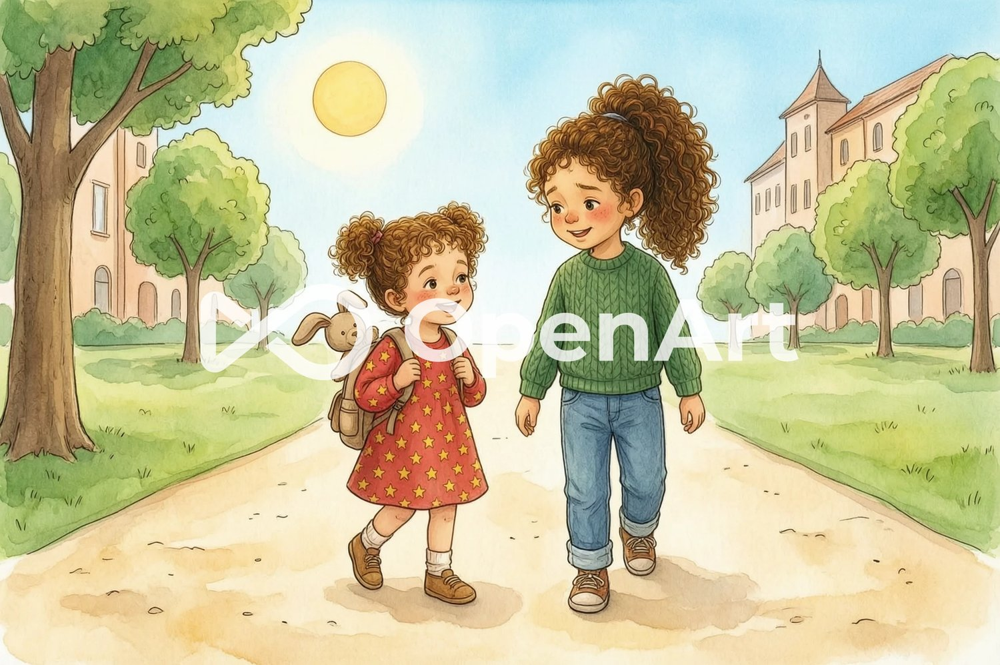
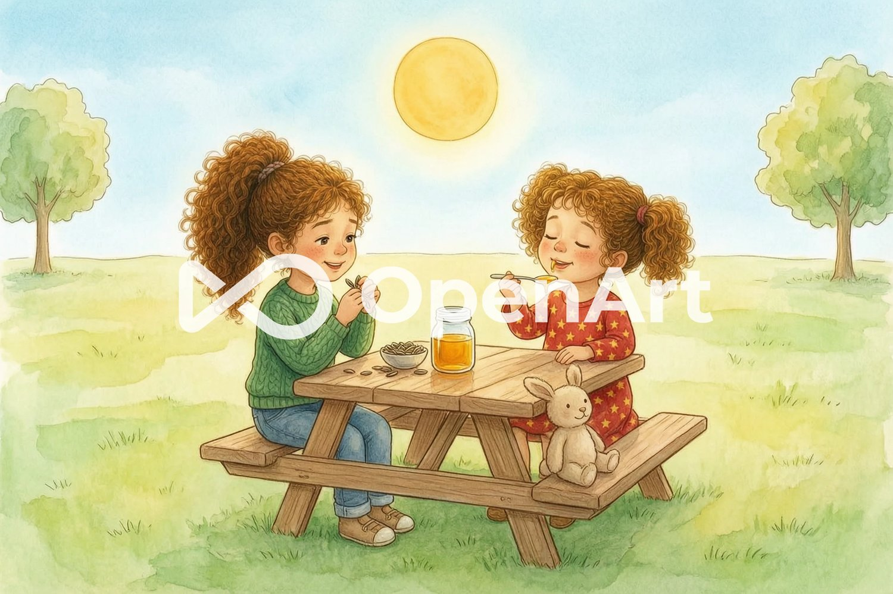
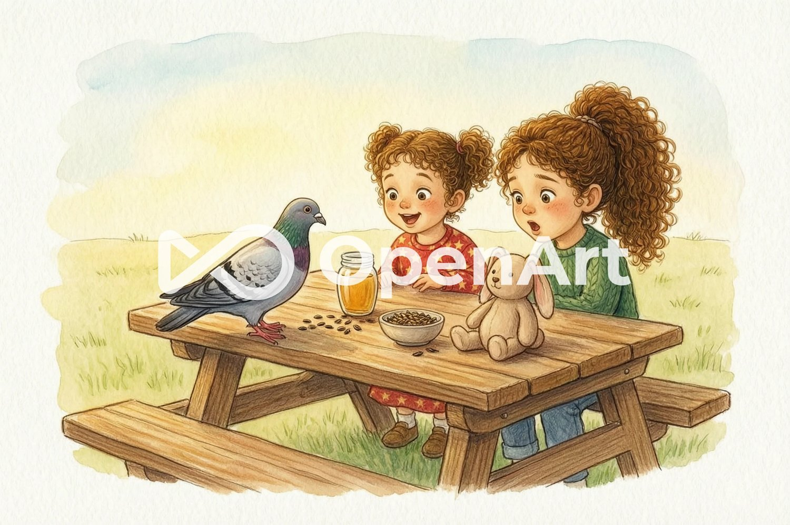
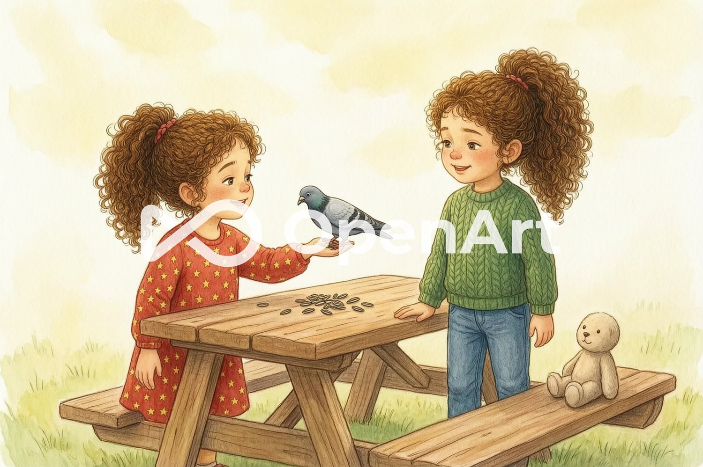
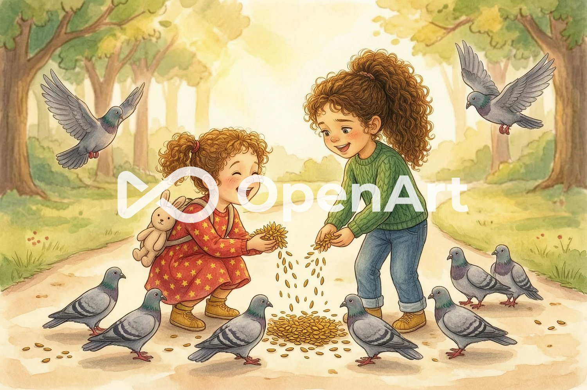
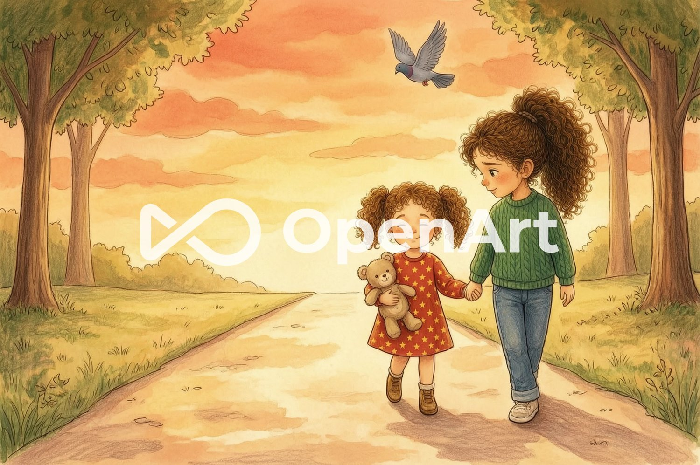

# LA PALOMA

- nivel: 1
- letras: A E I O U M P L S
- pendiente: rehacer las ilustraciones sin la marca de agua de OpenArt (plan gratuito). En la última, Peluso sale como osito en vez de conejo.

## Letras

A E I O U M P L S

## Sílabas

MA ME MI MO MU
PA PE PI PO PU
LA LE LI LO LU
SA SE SI SO SU

## Palabras

LI-LI · O-LI · PE-LU-SO · PA-SA · PA-LO-MA · PI-PAS · MIEL · ME-SA · SOL · PA-SE-O · A-SO-MA

## Cuento

LILI SALE AL PASEO.

PELUSO SE ASOMA.

OLI SALE AL PASEO.

SALE EL SOL.

¡A LA MESA!

¡MMM, MIEL!

OLI AMA LAS PIPAS.

SE ASOMA LA PALOMA.

¡PÍO, PÍO!

LA PALOMA PISA LA MESA.

LILI LE PASA PIPAS.

¡MMM! LA PALOMA AMA LAS PIPAS.

¡MÁS PALOMAS!

LILI PASA MÁS PIPAS. OLI PASA MÁS PIPAS.

¡PÍO, PÍO, PÍO!

LILI AMA EL PASEO.

## Guía para mamá y papá

**Antes de leer.** Repasad juntas la página de letras y la de sílabas. Leed las palabras separadas en sílabas despacio, dando palmadas en cada sílaba.

**Durante la lectura.** Una frase por página. Que Liliana señale con el dedo cada palabra mientras la lee. Si se atasca, ayudadla a leer sílaba a sílaba (PA… LO… MA) en vez de decirle la palabra entera. Los dibujos ayudan a entender la historia, pero la palabra se lee, no se adivina.

**Después de leer.** Preguntad: ¿qué le pasó a Lili con la paloma? ¿Por qué vinieron más palomas? Hablad de la idea del cuento: cuando compartimos, todo el mundo está más contento.

**Releer.** Leer el mismo libro varias veces es bueno: cada vez saldrá más fácil y con más confianza. Mejor sesiones cortas (5–10 minutos) que largas.
