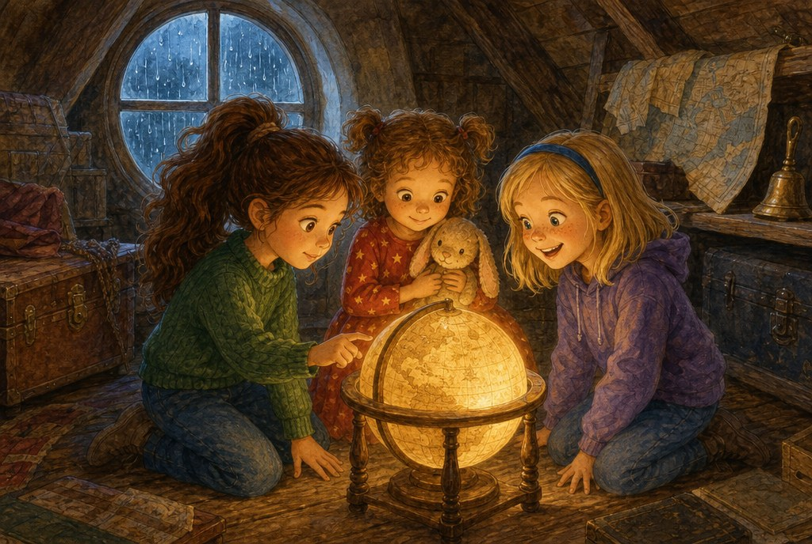
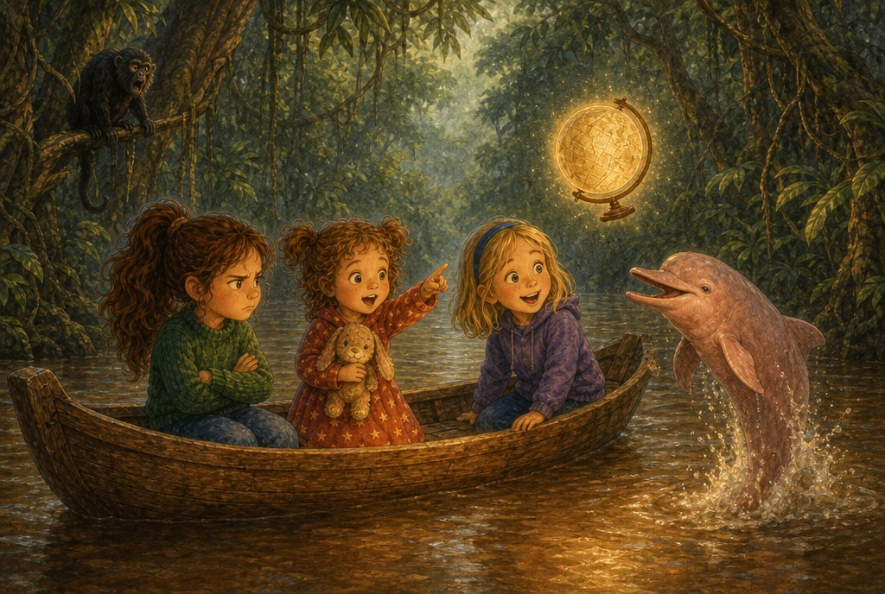
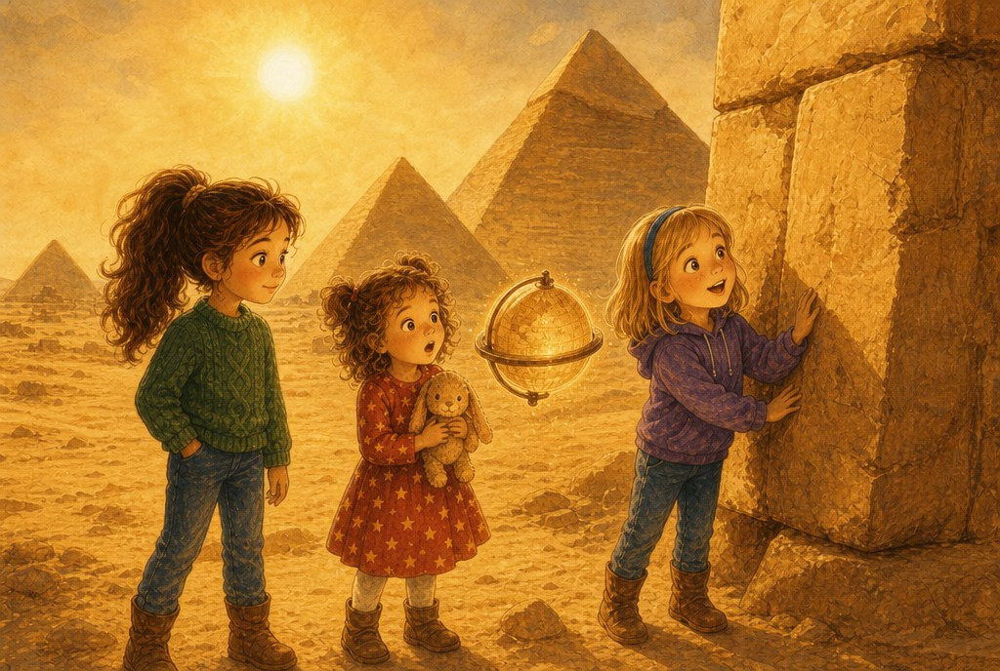
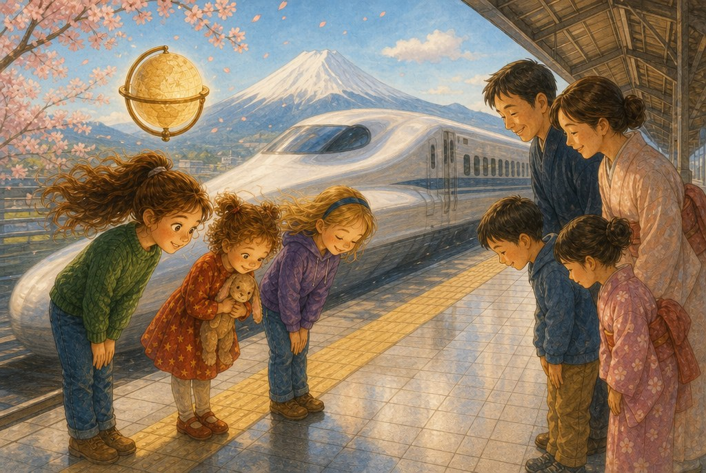
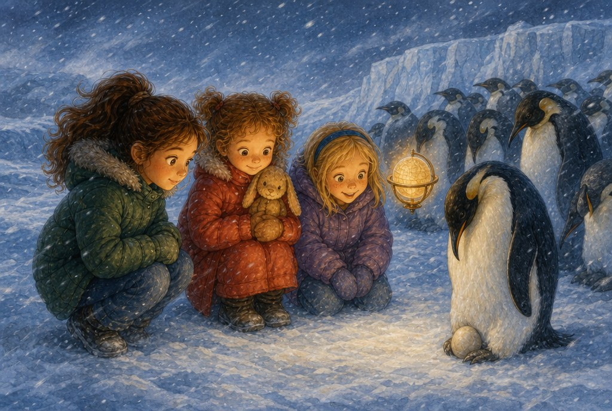
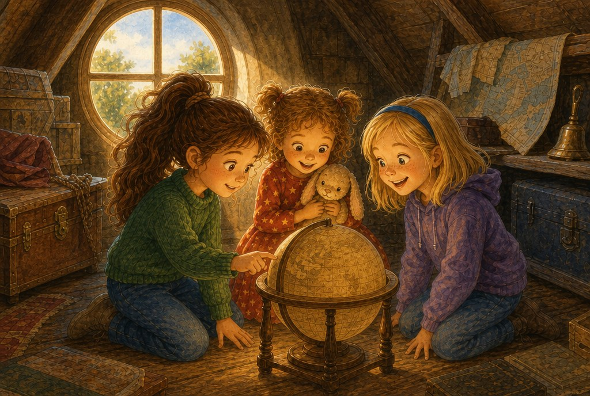

# El globo que solo contestaba preguntas

> ⏱️ Lectura: unos 10 minutos · 🌍 Tema: el mundo · 👧 Protagonistas: Olivia, Liliana y Matylda

---

## 1. Lo que había en el desván

Llovía tanto aquel sábado que las gotas parecían tambores en el tejado. Matylda, la mejor amiga de Olivia desde siempre, había venido a pasar la tarde, y las tres —con la pequeña Liliana— subieron al desván.

Entre baúles viejos y cajas llenas de polvo encontraron un globo terráqueo. Colgada de él había una etiqueta escrita con letra muy antigua:

*«Gírame y pon el dedo. Solo contesto preguntas. Volved cuando suene la campana.»*

—¡Ya sé lo que es! —dijo Olivia—. Es un globo mágico. Yo lo sé todo sobre globos.

Liliana abrazó a su conejo de peluche.

—¿Y a dónde nos lleva?

Olivia hizo girar el globo, puso el dedo encima y el desván desapareció.

## 2. La selva que respira

Hacía un calor húmedo, como estar dentro de una sopa. Estaban en una canoa, en medio de un río anchísimo rodeado de árboles tan altos que tapaban el cielo.

—Esto es la selva —dijo Olivia—. Ya lo sé.

De pronto, algo rosa saltó del agua.

—¡Un pez rosa! —gritó Olivia.

El globo, que flotaba a su lado, no dijo nada.

Entonces Liliana preguntó con su vocecita:

—¿Qué es eso rosa?

El globo brilló y habló con una voz suave, como de abuelo:

—Es un delfín rosado del Amazonas. No es un pez: respira aire, como vosotras. Este río, el Amazonas, lleva más agua que ningún otro río del mundo. Y esta selva es tan grande que la llaman «el pulmón del planeta».

En ese momento sonó un rugido tremendo entre los árboles. Liliana se tapó los ojos.

—¿Es un monstruo? —preguntó.

—Es un mono aullador —contestó el globo—. Es pequeño, pero su grito se oye a kilómetros.

Matylda se echó a reír. Olivia frunció el ceño. ¿Por qué el globo le hablaba a Liliana y a ella no?

## 3. Montañas de piedra en el desierto

Olivia giró el globo deprisa, para que nadie se le adelantara. Aparecieron en un mar de arena dorada. Delante de ellas se levantaban tres montañas perfectas, con forma de triángulo.

—Son las pirámides de Egipto —dijo Olivia—. Ya lo sé.

El globo siguió callado.

Matylda se acercó a una piedra enorme, más alta que ella.

—¿Cómo pudieron subir piedras tan grandes sin grúas? —preguntó.

—Con rampas, cuerdas, trineos de madera y miles de personas trabajando juntas —dijo el globo—. La Gran Pirámide tiene más de dos millones de bloques de piedra. La construyeron hace unos cuatro mil quinientos años.

—¡Hala! —dijeron Matylda y Liliana a la vez.

Olivia se quedó pensando. Empezaba a sospechar algo.

## 4. El tren más rápido y la montaña con sombrero

Esta vez fue Liliana quien giró el globo. Aparecieron en un andén limpísimo. Al fondo se veía una montaña perfecta con la punta blanca, como si llevara un sombrero de nieve. Pasó un tren blanco, de morro alargado, tan rápido que las despeinó.

Olivia abrió la boca para decir «ya lo sé»… y la volvió a cerrar. Respiró hondo.

—¿Dónde estamos? —preguntó, por fin.

El globo brilló más fuerte que nunca.

—En Japón, Olivia. Esa montaña es el monte Fuji, un volcán dormido. Y ese es un tren bala: puede ir a más de trescientos kilómetros por hora. Aquí, cuando la gente se saluda, muchas veces no se da la mano: inclina un poco la cabeza y el cuerpo. Es una forma de mostrar respeto.

Olivia sonrió. Qué sensación tan rara y tan buena: no saber algo y, de repente, saberlo.

Las tres niñas se inclinaron hacia el tren, como hacía la gente del andén. Y la gente les devolvió el saludo.

## 5. El papá que no se movía

¡Brrr! El último giro las llevó a un mundo blanquísimo. Por arte de magia, el globo les puso unos abrigos gordos y mullidos.

Delante de ellas había cientos de pingüinos, muy juntos, casi sin moverse.

—¿Por qué no se mueven? —preguntó Olivia.

—Porque son papás —dijo el globo—. Estamos en la Antártida, el lugar más frío del planeta. Estos pingüinos emperador llevan un huevo encima de las patas y lo tapan con la barriga para que no se congele. Así pasan unos dos meses, en pleno invierno, sin comer nada, mientras las mamás van al mar a buscar comida.

Liliana abrazó más fuerte a su conejo.

—Son muy valientes —susurró.

Y entonces, lejos, muy lejos, sonó una campana: *¡tolón, tolón!*

## 6. De vuelta a casa

—¡La campana! —gritó Matylda—. ¡Hay que volver!

—¿Cómo volvemos a casa? —preguntó Olivia.

—Así —dijo el globo, y dio un último giro.

Aparecieron en el desván. Ya no llovía y entraba un rayo de sol. El globo volvía a ser un globo normal.

—¿Sabéis qué? —dijo Olivia—. Al principio yo decía «ya lo sé» todo el rato, y el globo no me contaba nada.

—Pero luego empezaste a preguntar —dijo Matylda.

—Y aprendiste lo del tren —añadió Liliana—. ¡Y lo de los pingüinos!

Olivia giró el globo despacito, mirando todos esos países que aún no conocía.

—Mañana pregunto yo primero —dijo.

---

> ### 🌟 Moraleja
>
> **Quien cree que ya lo sabe todo deja de aprender. Quien se atreve a preguntar descubre el mundo entero.**
> No pasa nada por no saber algo: preguntar no es de tontos, es de valientes y de curiosos.

---

### 🗺️ Lo que aprendimos en este viaje

| Lugar | Lo que descubrimos |
|---|---|
| 🌳 El Amazonas (Sudamérica) | Es el río que lleva más agua del mundo. Allí viven delfines rosados y monos aulladores. |
| 🏜️ Egipto (África) | La Gran Pirámide tiene más de dos millones de bloques de piedra y unos 4.500 años. |
| 🗻 Japón (Asia) | El monte Fuji es un volcán. El tren bala va a más de 300 km/h. Se saluda inclinando el cuerpo. |
| 🐧 La Antártida | Es el lugar más frío del planeta. Los papás pingüino emperador cuidan el huevo sobre sus patas. |

**Pregunta para después de leer:** si el globo te llevara a ti, ¿a qué lugar del mundo irías y qué le preguntarías?
