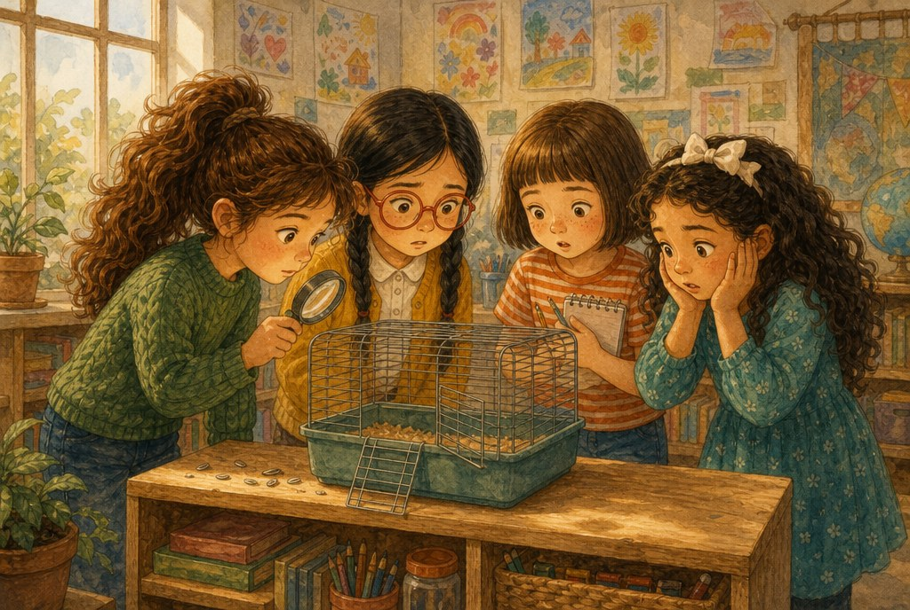
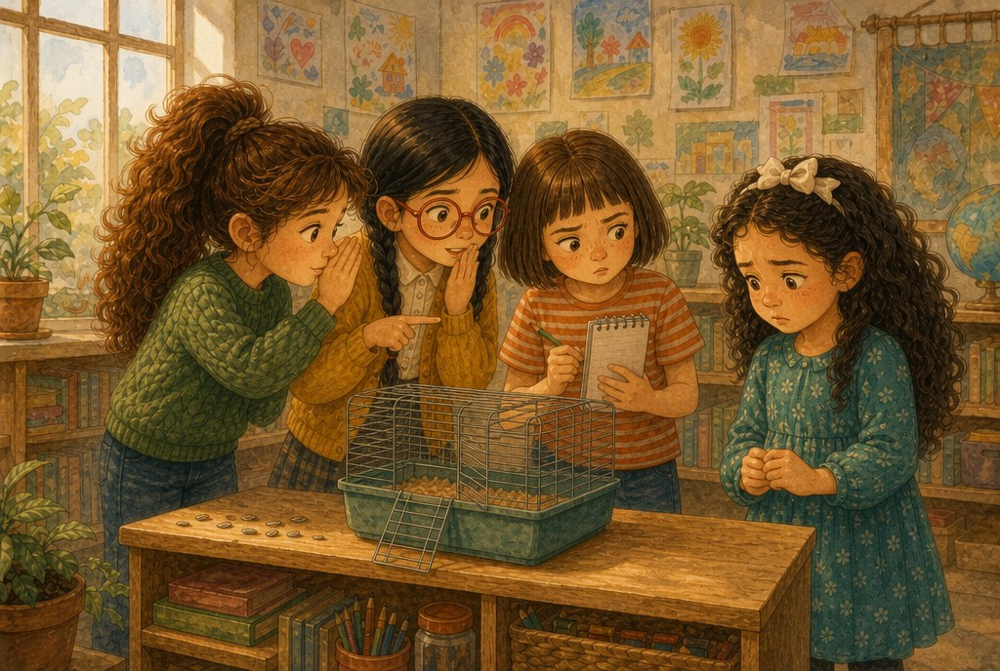
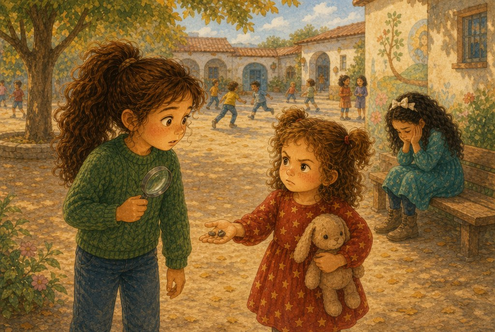
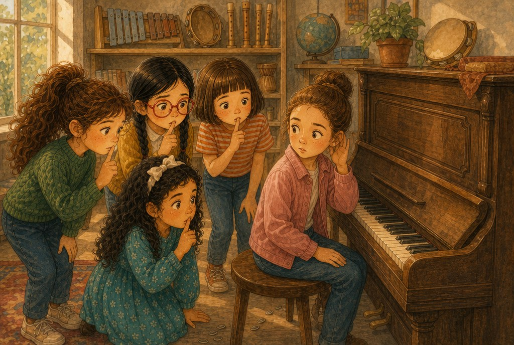
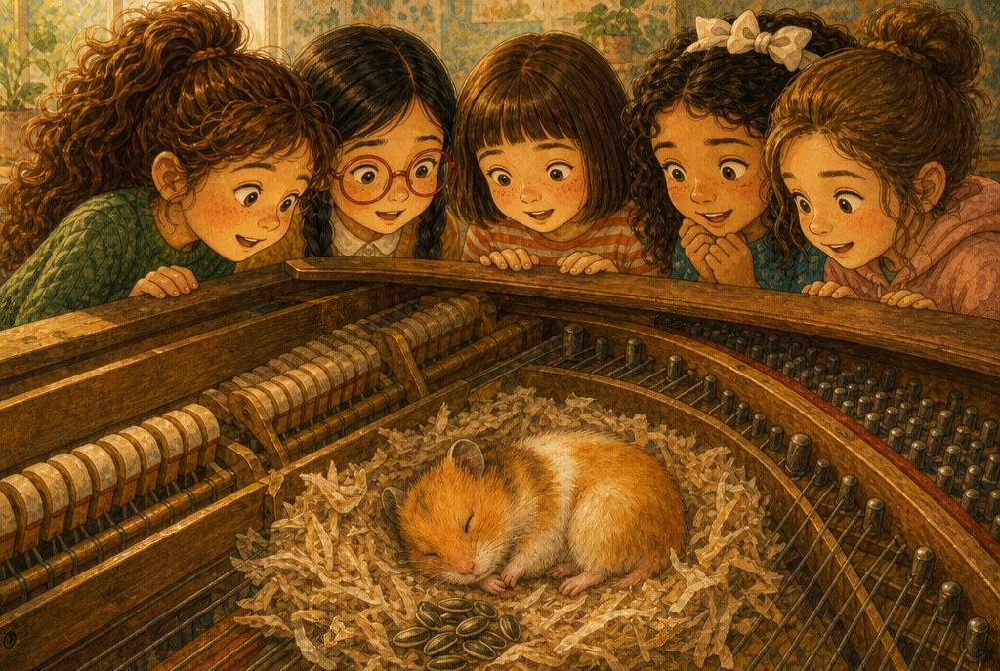
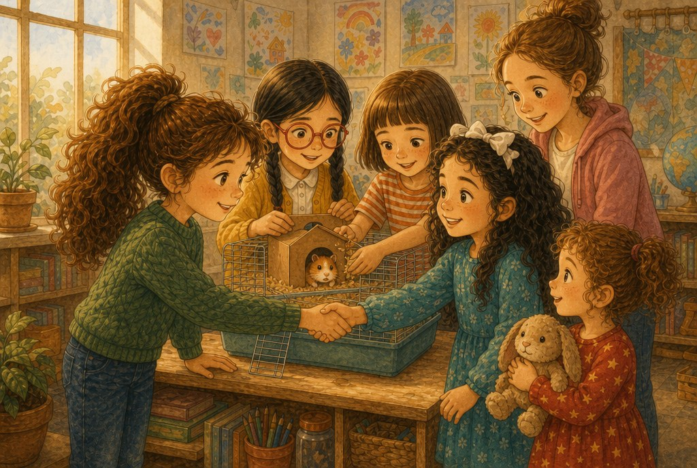

# El caso del hámster desaparecido

> ⏱️ Lectura: unos 10 minutos · 🌍 Tema: un misterio en el cole · 👧 Protagonistas: Olivia, Olaya, Sofía, Jana, Claudia y Liliana

---

## 1. La jaula vacía

El lunes por la mañana, la clase de segundo estaba patas arriba. La jaula de Garbanzo, el hámster de la clase, estaba vacía. La puertecita estaba entreabierta y en la estantería solo quedaban unas cuantas cáscaras de pipa.

—¡Garbanzo ha desaparecido! —gritó Olaya, y se le empañaron las gafas del susto.

La seño Marta pidió calma, pero Olivia ya había sacado de su mochila una lupa de juguete.

—Tranquilas —dijo—. Esto es un caso para detectives.

Sofía abrió su libreta por una página en blanco y escribió con letra grande: *EL CASO DEL HÁMSTER DESAPARECIDO.*

Jana no dijo nada. Se había quedado muy quieta, con las manos en las mejillas.

## 2. La primera sospechosa

—Primera pregunta —dijo Olivia, como los detectives de las películas—. ¿Quién le dio de comer el viernes?

Todas se giraron hacia Jana. Esa semana le tocaba a ella cuidar de Garbanzo.

—Yo… yo cerré la puerta —dijo Jana bajito—. Estoy segura.

Sofía entornó los ojos.

—A lo mejor se lo llevó a su casa. Es la que más lo quiere.

—¡Eso es! —dijo Olivia—. Tiene sentido.

Y en la libreta de Sofía apareció una palabra que dolía solo de leerla: *SOSPECHOSA: JANNA.*

A Jana le temblaron los labios. No lloró delante de todas, pero cuando sonó el timbre del recreo salió la primera y se sentó sola en un banco del patio.

## 3. Una pista muy pequeña

En el recreo, Liliana vino corriendo desde el patio de los pequeños. Traía algo en la mano.

—¡Olivia! ¡Hay pipas en el pasillo! Muchas, en fila, como las migas de Pulgarcito.

Olivia no le hizo mucho caso.

—Ahora no, Lili. Ya sabemos quién ha sido.

Liliana frunció el ceño.

—¿Quién?

—Jana.

Liliana miró hacia el banco donde Jana estaba sola, con la cabeza agachada. Luego miró a su hermana.

—¿La has visto tú llevárselo? —preguntó.

—No, pero…

—Entonces no lo sabes —dijo Liliana.

Y se fue a sentarse con Jana.

Olivia se quedó con la lupa en la mano y una sensación rara en la tripa. Su hermana pequeña tenía razón. No tenían ninguna prueba. Solo una sospecha.

## 4. El piano que sonaba raro

Por la tarde tocaba música, y a la clase de música venía Claudia, que tocaba el piano mejor que nadie y tenía un oído finísimo.

Olivia siguió el rastro de pipas por el pasillo. Llevaba justo hasta la puerta del aula de música.

Claudia se sentó al viejo piano y empezó a tocar. De pronto paró.

—Qué raro —dijo—. La nota *do* suena como apagada. Y he oído algo… como un *cric, cric*.

Todas se callaron. Dentro del piano, algo arañaba muy flojito.

—Los hámsteres duermen de día y se despiertan por la tarde —dijo Olaya, que sabía muchas cosas de animales—. Y les encanta esconderse en sitios pequeños y oscuros.

Olivia y Claudia se miraron. Con cuidado, levantaron la tapa del piano.

## 5. Villa Garbanzo

¡Allí estaba Garbanzo! Se había hecho un nido precioso entre las cuerdas, con trocitos de papel de partituras viejas. A su lado tenía un montón de pipas.

—¡Mirad qué mofletes! —rio Sofía.

—Los hámsteres guardan la comida en los mofletes, como si fueran bolsillos —explicó Olaya—. Luego la esconden en su despensa.

La seño Marta miró la jaula de cerca y encontró la verdadera respuesta. El pestillo de la puerta tenía un tornillo flojo. Aunque alguien la cerrara bien, Garbanzo podía empujarla con el hocico y escaparse.

—Nadie tiene la culpa —dijo la seño—. Solo un tornillo.

Olivia sintió que se le ponían las orejas rojas. Jana había dicho la verdad desde el principio.

## 6. Lo que no estaba en la libreta

Olivia fue hasta Jana, que tenía a Liliana todavía cogida de la mano.

—Jana, perdona —dijo—. Te acusamos sin pruebas. Eso no se hace. Nos equivocamos.

Sofía arrancó la página de la libreta, la arrugó y la tiró a la papelera.

—Yo también lo siento —dijo.

Jana se quedó pensando un momento. Luego sonrió, y fue como si saliera el sol.

—Vale. Pero la próxima vez, preguntadme primero.

Entre todas apretaron el tornillo del pestillo y le prepararon a Garbanzo una caja de cartón con papelitos, para que tuviera un escondite dentro de la jaula. Jana le puso nombre: *Villa Garbanzo*.

—Oye, Lili —dijo Olivia en el camino a casa—. Hoy la mejor detective has sido tú.

Liliana sonrió de oreja a oreja.

---

> ### 🌟 Moraleja
>
> **Una sospecha no es una prueba. Antes de acusar a alguien, busca la verdad y escúchale.**
> Una acusación injusta hace mucho daño, y pedir perdón cuando te equivocas es de valientes.

---

### 🐹 Lo que aprendimos sobre los hámsteres

| Dato | Explicación |
|---|---|
| Duermen de día | Son animales nocturnos: se despiertan al atardecer y pasan la noche activos. |
| Mofletes-bolsillo | Guardan la comida en unas bolsas de las mejillas y luego la esconden en su "despensa". |
| Grandes escapistas | Se cuelan por huecos muy pequeños y les encantan los sitios oscuros para hacer su nido. |

**Pregunta para después de leer:** ¿alguna vez has pensado algo de alguien y luego resultó que no era verdad? ¿Qué pasó?
