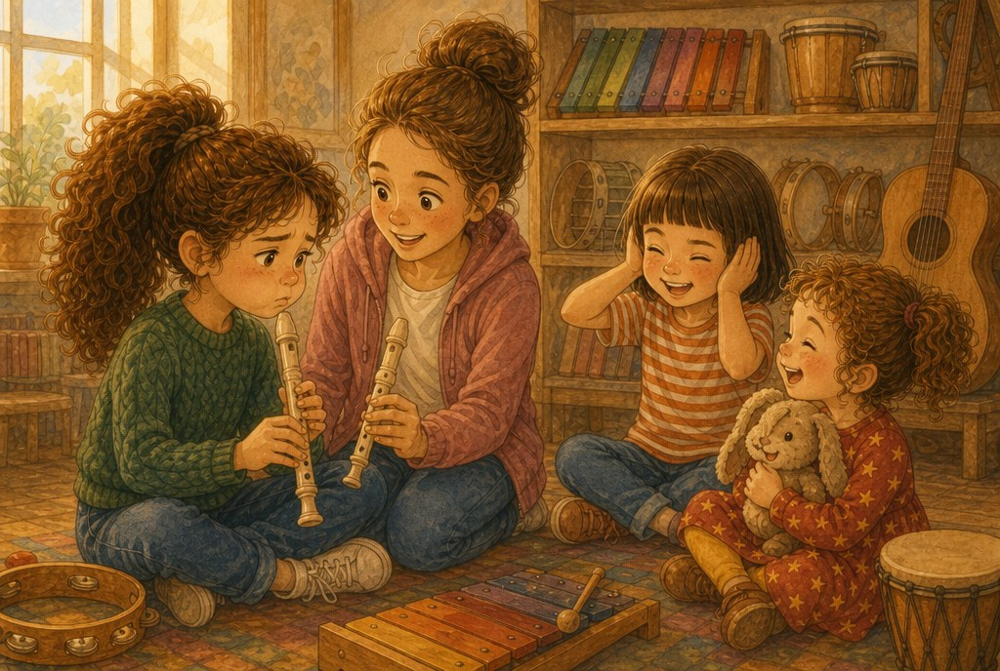
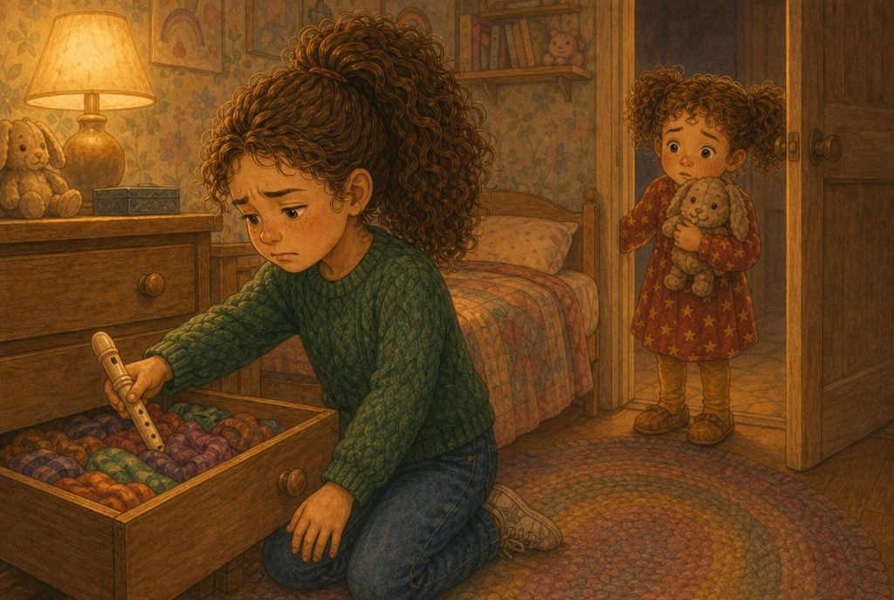
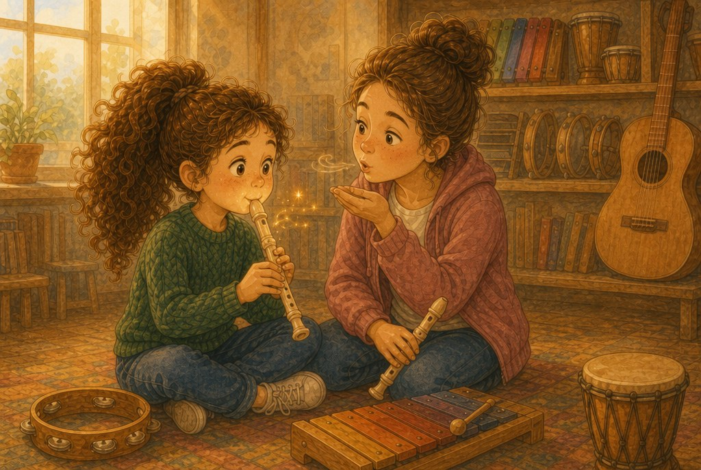
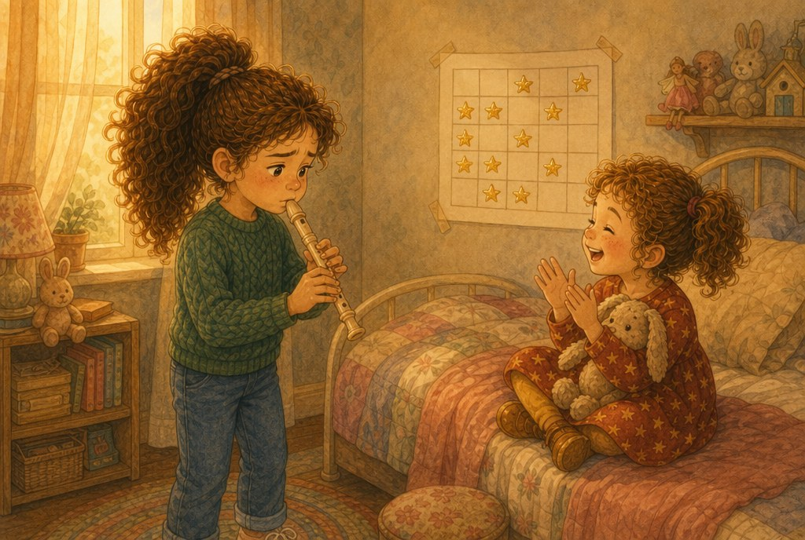
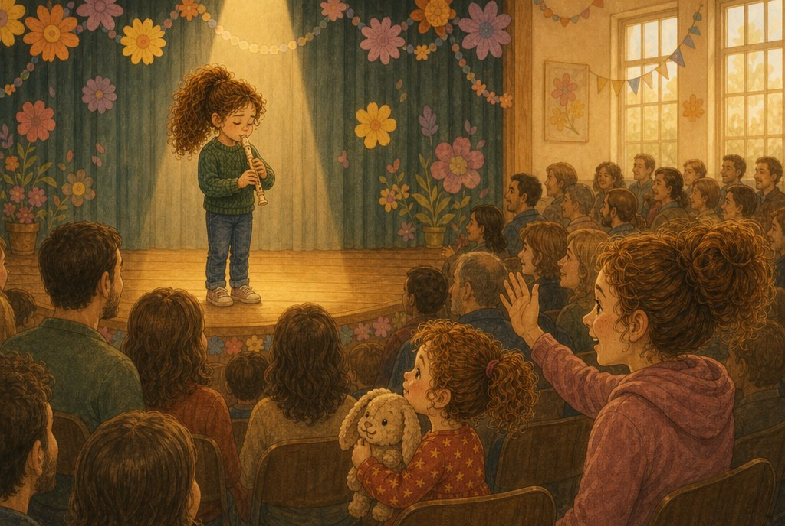
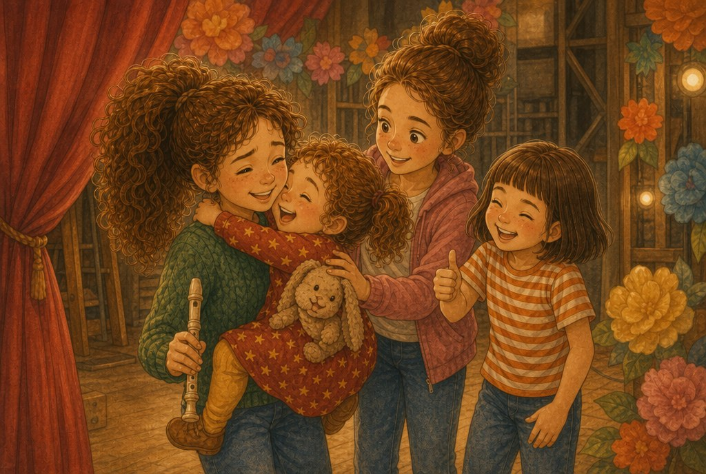

# La nota que se escapaba

> ⏱️ Lectura: unos 10 minutos · 🌍 Tema: la música · 👧 Protagonistas: Olivia, Claudia, Sofía y Liliana

---

## 1. Un solo para Olivia

—Este año, en el festival de primavera, cada clase tocará una canción —anunció la seño Marta—. Y en la nuestra habrá un solo de flauta.

Veinticinco manos se levantaron a la vez. La seño eligió a Olivia.

Olivia volvió a casa dando saltos. ¡Un solo! Ella sola, delante de todo el colegio, tocando el *Himno de la alegría*.

Pero al día siguiente, en el ensayo, se llevó la flauta a los labios, sopló… y la flauta soltó un pitido agudísimo:

—¡Fiiiiiiii!

Sofía se tapó los oídos de broma. Unos cuantos se rieron. Liliana, que había venido a ver el ensayo, soltó una risita.

Olivia se puso roja como un tomate. Lo intentó otra vez. ¡Fiiiii! Peor todavía.

## 2. La flauta en el cajón

Esa tarde, Olivia metió la flauta en el fondo de un cajón, debajo de los calcetines.

—No sirvo para esto —dijo—. Se lo voy a decir a la seño. Que toque otra.

Liliana la miraba desde la puerta, abrazada a su conejo.

—¿Por qué pita la flauta? —preguntó.

—¡No lo sé! —contestó Olivia, más fuerte de lo que quería—. Porque soy un desastre.

Liliana se fue sin decir nada. Olivia se tumbó en la cama. Le daba rabia no saber hacerlo bien a la primera. En el cole casi todo le salía bien a la primera. Leer, sumar, dibujar… ¿Por qué la flauta no?

## 3. Lo que sabía Claudia

El jueves, en la clase de música de la tarde, Olivia se lo contó a Claudia.

—Lo voy a dejar —dijo.

Claudia no se rio. Al contrario.

—Cuando empecé con el piano, lloraba todos los días —le confesó—. Me equivocaba en todas las notas.

—¿Tú? —Olivia no se lo podía creer. Claudia tocaba de maravilla.

—Yo. Mira, los errores no son malos. Son pistas: te dicen lo que tienes que practicar. —Cogió la flauta de Olivia—. Tu pista es que soplas muy fuerte. El sonido es aire que vibra, que tiembla muy deprisa dentro del tubo. Si soplas como un huracán, tiembla demasiado y pita. Tienes que soplar suave, como cuando enfrías una sopa.

Olivia sopló flojito. La flauta sonó limpia y redonda. *Tuuu.*

## 4. Diez minutos cada día

Desde ese día, Olivia practicó diez minutos cada tarde. Sacó la flauta del cajón y pegó en la pared una hoja con los días de la semana. Por cada día de práctica, una pegatina de estrella.

Claudia le había dado otro truco:

—Toca la canción muy, muy despacio. Y por trozos. Los músicos de verdad practican así: primero lento y luego más rápido.

El lunes todavía pitaba de vez en cuando. El miércoles, menos. El viernes, casi nada.

Liliana se convirtió en su público. Se sentaba en la cama con el conejo y aplaudía al final, aunque saliera regular.

—¿Por qué aplaudes si me he equivocado? —le preguntó Olivia un día.

—Porque te he visto intentarlo —dijo Liliana—. Y porque ya casi no pita.

## 5. El gran día

El día del festival, el salón de actos estaba lleno. Olivia se asomó entre las cortinas y vio a mamá, a papá, a Liliana en primera fila y a Claudia saludándola con la mano.

El corazón le hacía *pum, pum, pum*, como un tambor. Le sudaban las manos.

Salió al escenario. Se acercó la flauta a los labios. Sopló suave, como a una sopa.

La primera parte le salió perfecta. La segunda, también. Y entonces, justo en la mitad…

—¡Fiii!

Un pitido pequeñito. Olivia sintió que se le paraba el corazón. Quería salir corriendo.

Pero se acordó de Claudia: «Si te equivocas, sigue. El público no sabe cómo es la canción; tú sí.»

Respiró hondo. Y siguió tocando hasta la última nota.

## 6. El aplauso

El salón entero aplaudió. Sofía silbó con los dedos. Liliana se puso de pie encima de la silla.

Detrás del escenario, Olivia tenía los ojos un poco húmedos.

—Me he equivocado —le dijo a Claudia—. Ese pitido…

—¿Sabes quién lo ha notado? —dijo Claudia—. Tú y yo. Nadie más. Y yo he visto lo más difícil: que no te has parado.

Liliana llegó corriendo y se le colgó del cuello.

—¡A mí me ha gustado el pitido! —dijo—. Ha sido como un pajarito.

Olivia se echó a reír. Todas se rieron.

Esa noche, antes de dormir, Olivia no guardó la flauta en el cajón. La dejó encima de la mesa, para practicar al día siguiente una canción nueva.

---

> ### 🌟 Moraleja
>
> **Equivocarse no es fracasar. Rendirse sin intentarlo, sí.**
> Nadie aprende algo difícil a la primera: cada error es una pista que te dice qué tienes que practicar.

---

### 🎵 Lo que aprendimos sobre la música

| Dato | Explicación |
|---|---|
| El sonido es vibración | Cuando algo tiembla muy deprisa (una cuerda, el aire dentro de una flauta, la piel de un tambor), hace sonido. |
| Familias de instrumentos | **Viento**: se soplan (flauta, trompeta). **Cuerda**: tienen cuerdas que vibran (guitarra, violín). **Percusión**: se golpean (tambor, xilófono). |
| Cómo practican los músicos | Primero despacio y por trozos. Cuando sale bien lento, se va subiendo la velocidad. |

**Pregunta para después de leer:** ¿hay algo que al principio te salía mal y ahora te sale bien? ¿Cómo lo conseguiste?
