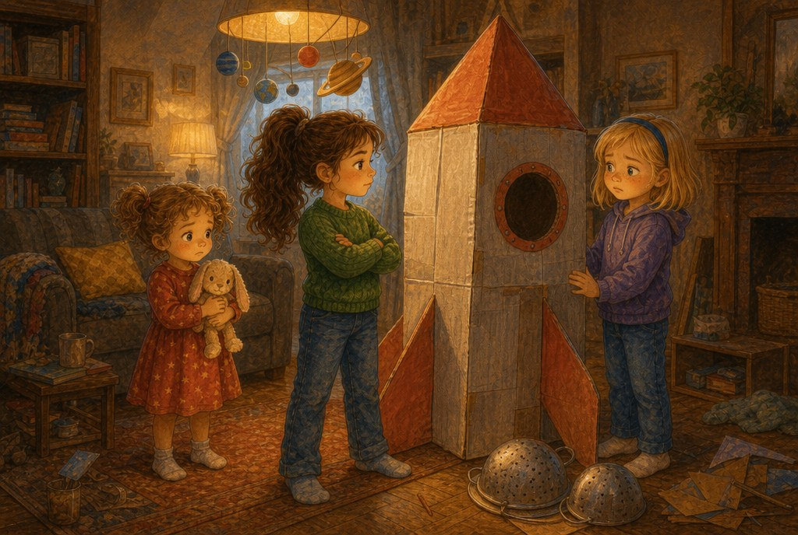
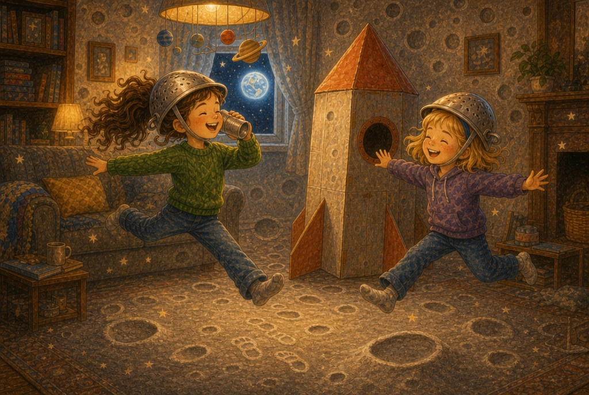
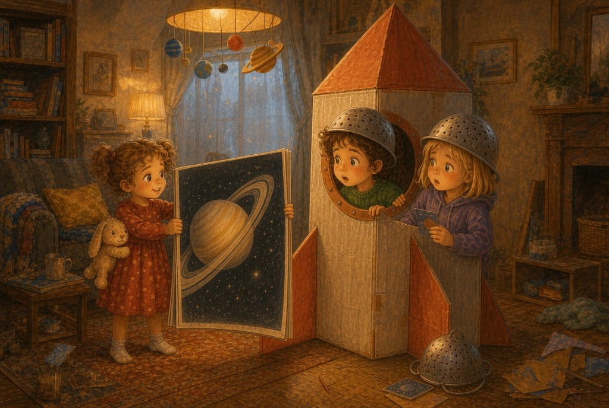
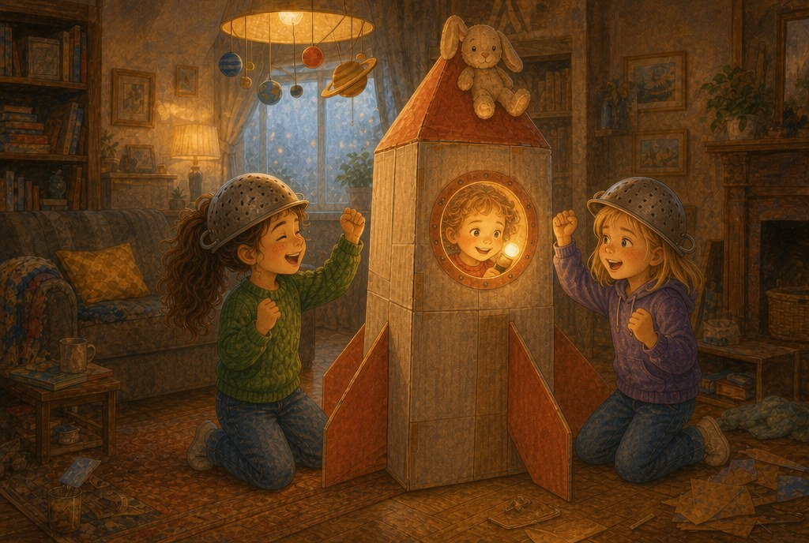
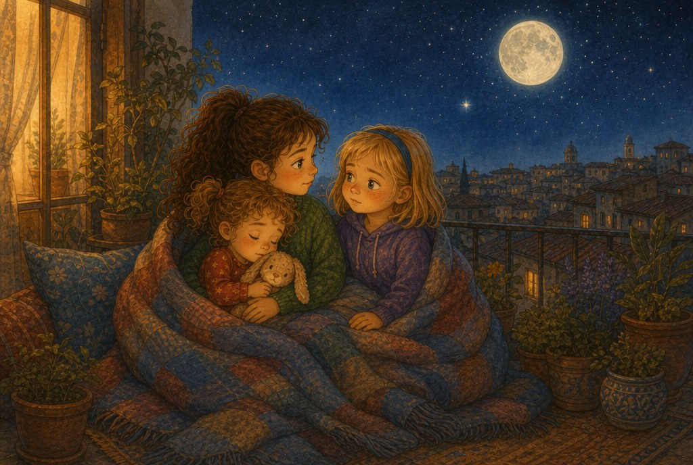

# El cohete de cartón

> ⏱️ Lectura: unos 10 minutos · 🌍 Tema: el espacio · 👧 Protagonistas: Olivia, Liliana y Matylda

---

## 1. Solo para astronautas

Aquel sábado, el salón de casa se convirtió en una base espacial. Olivia y Matylda habían construido un cohete con tres cajas de cartón, un rollo entero de cinta adhesiva y mucha pintura plateada. Tenía una ventana redonda, unas aletas rojas y un nombre escrito en un lado: *Aventura 1*. Dentro había dos cojines como asientos y una caja de zapatos llena de botones pintados: el panel de control.

Liliana apareció en la puerta con su conejo.

—¿Puedo ser astronauta yo también?

Olivia se cruzó de brazos delante del cohete.

—No, Lili. Eres muy pequeña. Los astronautas tienen que saber un montón de cosas del espacio.

—Yo sé cosas —dijo Liliana bajito.

—Que no. Vete a jugar a tu cuarto.

Matylda miró a Olivia sin decir nada. Liliana se dio la vuelta y se fue arrastrando al conejo por una oreja.

## 2. Diez, nueve, ocho…

—¡Diez, nueve, ocho…! —contaron las dos, metidas en el cohete—. ¡Tres, dos, uno… despegue!

Matylda había traído un juego de misiones espaciales. Cada misión era una tarjeta, y para pasar a la siguiente había que contestar una pregunta.

La primera fue fácil: *Aterrizad en la Luna.*

Salieron del cohete dando saltos lentos, como en las películas.

—En la Luna pesas seis veces menos —explicó Olivia—. Por eso los astronautas saltan tanto.

—Y como allí no hay aire ni viento, las huellas de los astronautas siguen ahí —añadió Matylda—. Pueden durar millones de años.

Dejaron sus huellas de calcetín en la alfombra y volvieron al cohete.

—Aquí *Aventura 1* —dijo Olivia por un vaso de yogur que hacía de radio—. Misión Luna, completada. Matylda sacó la segunda tarjeta y la leyó en voz alta:

—*¿Qué planeta flotaría si lo metieras en una bañera gigante?*

Las dos se quedaron calladas. Ninguna lo sabía.

## 3. La voz de la puerta

—Saturno.

Olivia y Matylda se giraron. Liliana estaba en la puerta, con un libro de planetas casi más grande que ella.

—Saturno está hecho casi todo de gas, y es tan ligero que flotaría en el agua —dijo—. Papá me lo lee todas las noches. Y yo le pregunto un montón de porqués.

Matylda sacó otra tarjeta, con los ojos muy abiertos.

—*¿Cuántas Tierras cabrían dentro de Júpiter?*

—¡Más de mil! —dijo Liliana sin pensarlo—. Es el planeta más grande de todos.

Olivia sintió algo raro en la tripa. Era la misma sensación de cuando te das cuenta de que te has equivocado. Su hermana pequeña sabía cosas que ella no sabía. Y ella la había echado.

## 4. Una tripulación completa

—Lili —dijo Olivia—. Perdona. No debí decirte que eras pequeña. ¿Quieres ser de la tripulación?

Liliana sonrió tanto que se le vieron todos los dientes.

Pero entonces pasó algo: la linterna que hacía de motor se había caído dentro del cohete, en un rincón donde no llegaba ninguna. La puerta de atrás era muy estrecha.

—Yo quepo —dijo Liliana.

Se metió a gatas, cogió la linterna y la encendió. El cohete entero se iluminó por dentro, como si de verdad tuviera un motor.

—¡Motor en marcha, comandante! —gritó Liliana desde dentro.

Matylda leyó la última tarjeta: *¿Cuál es la estrella más cercana a la Tierra?*

Las tres se miraron y contestaron a la vez:

—¡El Sol!

—Y su luz tarda unos ocho minutos en llegar hasta aquí —añadió Liliana.

## 5. Noche de estrellas

Esa noche, Matylda se quedó a dormir. Antes de acostarse, salieron las tres al balcón con una manta. La Luna estaba redonda y brillante, y por encima de los tejados el cielo estaba lleno de puntitos de luz.

—Ahí arriba están nuestras huellas —dijo Matylda.

—Las de los astronautas de verdad —la corrigió Olivia, riéndose.

Liliana señaló una lucecita que no parpadeaba.

—Eso es un planeta —dijo—. Las estrellas parpadean y los planetas no.

—¿Eso también te lo ha leído papá?

—No. Eso se lo pregunté yo.

Olivia se quedó pensando. A lo mejor hacer tantas preguntas no era cosa de pequeñas. A lo mejor era cosa de listas.

Poco a poco, a Liliana se le fueron cerrando los ojos, hasta que se quedó dormida con la cabeza en el hombro de su hermana.

—Mañana tú eres la comandante —le susurró Olivia.

Y aunque estaba dormida, Liliana sonrió.

---

> ### 🌟 Moraleja
>
> **Nadie es demasiado pequeño para ayudar.**
> Cuando dejas a alguien fuera del juego, también te pierdes todo lo que sabe y todo lo que puede hacer.

---

### 🚀 Lo que aprendimos sobre el espacio

| Dato | Explicación |
|---|---|
| En la Luna pesas menos | Unas seis veces menos que en la Tierra. Por eso los astronautas dan saltos tan grandes. |
| Huellas que no se borran | En la Luna no hay aire ni viento, así que las huellas de los astronautas pueden durar millones de años. |
| Saturno flotaría | Está hecho casi todo de gas y es más ligero que el agua. |
| Júpiter, el gigante | Dentro cabrían más de mil planetas como la Tierra. |
| El Sol es una estrella | Es la más cercana a nosotros. Su luz tarda unos ocho minutos en llegar. |
| Estrellas y planetas | Vistas desde aquí, las estrellas suelen parpadear y los planetas brillan fijos. |

**Pregunta para después de leer:** ¿alguna vez alguien más pequeño que tú te ha enseñado algo? ¿Qué fue?
