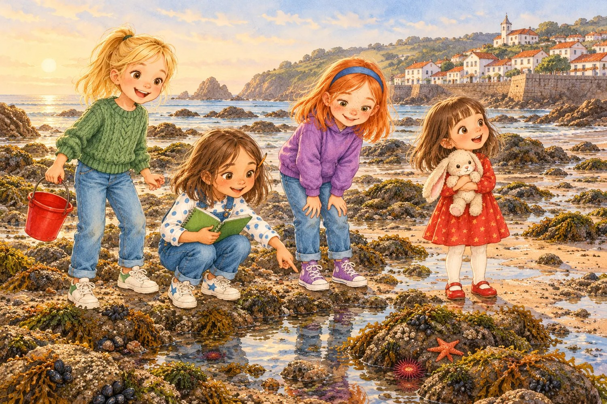
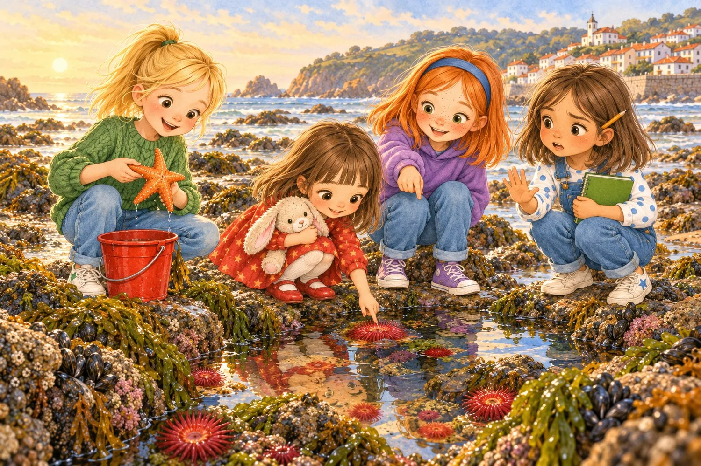
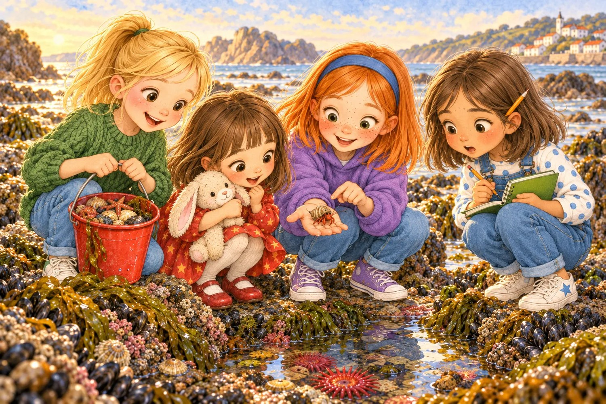
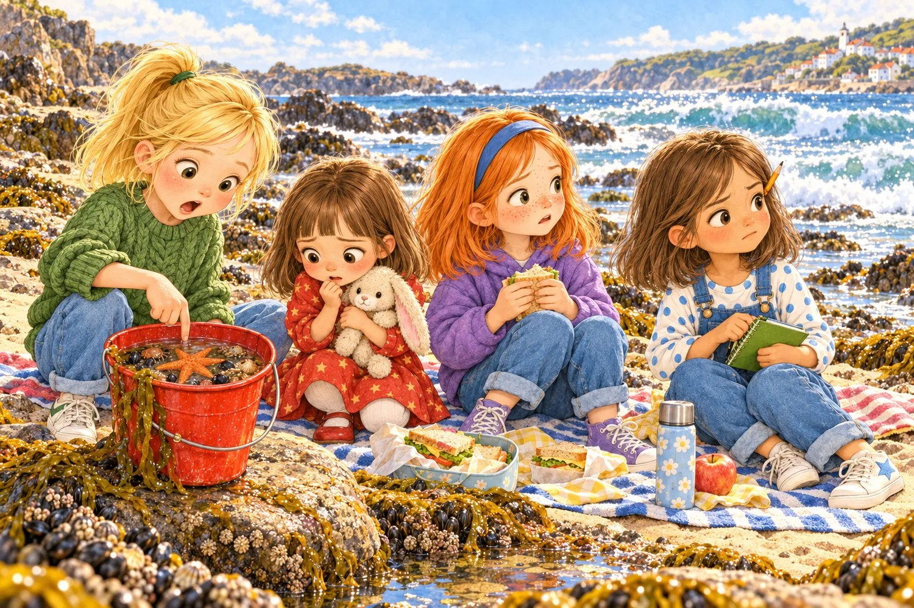
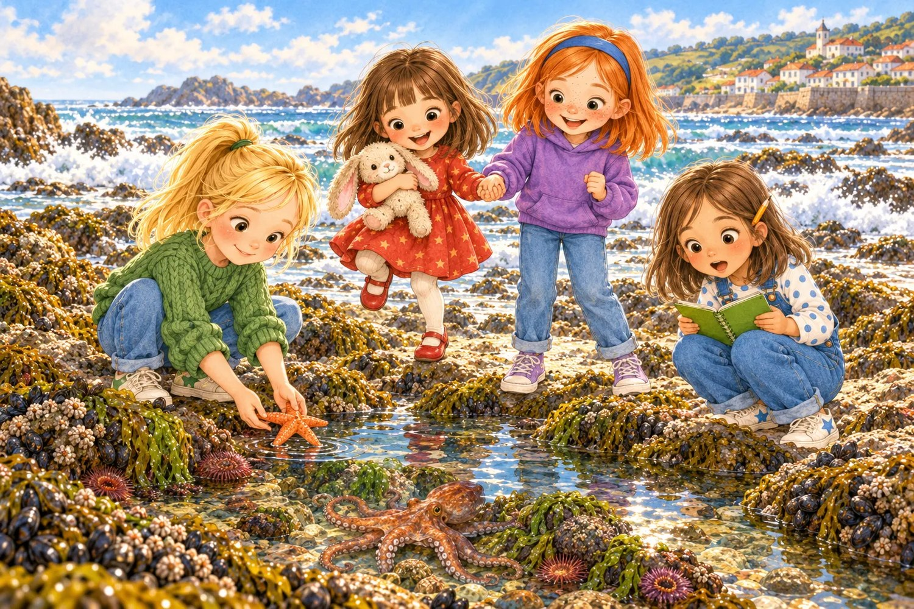
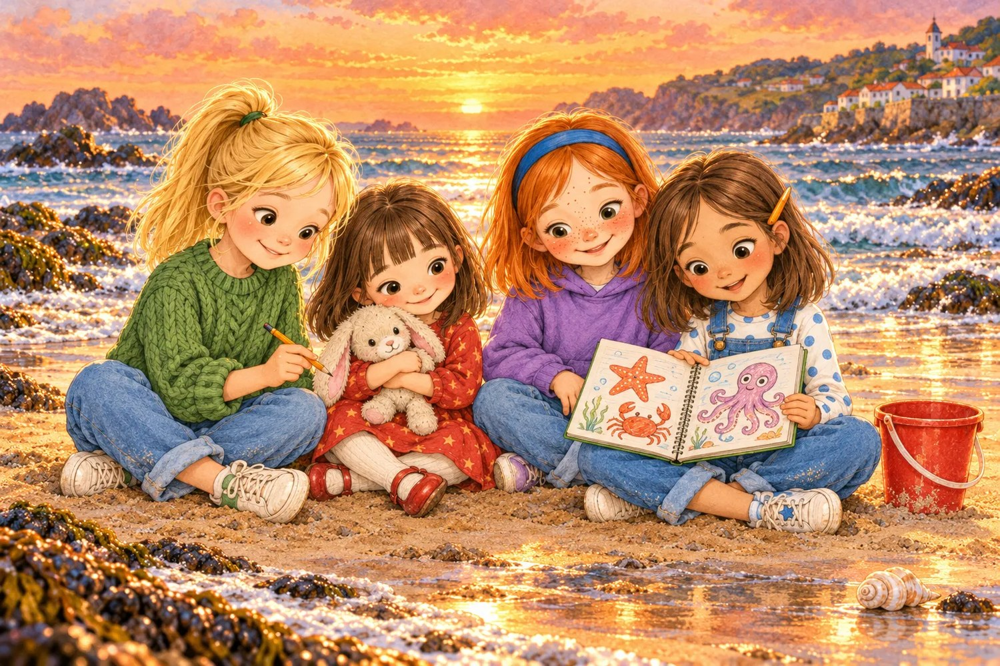

# Lo que guardaba la poza

> ⏱️ Lectura: unos 15 minutos · 🌍 Tema: el mar y sus animales · 👧 Protagonistas: Olivia, Liliana, Matylda y Ana

---

## 1. Cuando el mar se va

Aquel verano, Olivia y Liliana pasaron unos días en un pueblecito del norte, junto al mar. La primera mañana, papá las despertó muy temprano.

—¡Arriba, exploradoras! La marea está baja.

En la playa las esperaban Matylda, con su diadema azul y su pelo naranja brillando al sol, y Ana, que nunca iba a ningún sitio sin su cuaderno de tapas verdes y un lápiz detrás de la oreja.

Olivia se quedó con la boca abierta. La noche anterior, el agua llegaba casi hasta el paseo. Ahora el mar se había retirado muchísimo y había dejado al descubierto un montón de rocas oscuras, llenas de charcos brillantes.

—¿Adónde se ha ido el mar? —preguntó Liliana, apretando a Peluso contra el pecho.

—No se ha ido, se ha echado para atrás —explicó Ana, abriendo su cuaderno—. Es la marea. La Luna tira del agua de los océanos, como si fuera un imán muy flojito. Por eso, dos veces al día, el mar sube, y otras dos veces baja.

—Y cuando baja —añadió Matylda—, quedan las pozas. Mi abuelo dice que son como acuarios que nadie ha cerrado con llave.

Olivia levantó su cubo rojo, vacío y reluciente.

—Pues yo voy a llenar este cubo de tesoros —anunció—. Y me los llevo todos a casa.

Ana la miró un segundo, como si fuera a decir algo. Pero no dijo nada. Todavía.

## 2. Flores que no son flores

La primera poza era tan transparente que parecía que no tenía agua. En el fondo había piedrecitas, algas que se movían despacio y unas bolitas rojas y brillantes pegadas a la roca.

—¡Mirad, tomates! —gritó Liliana.

—Son anémonas —leyó Ana en su cuaderno, donde había pegado fotos de animales del mar—. Parecen flores, pero son animales. Cuando el agua las cubre, abren unos bracitos para atrapar comida. Y cuando las tocas, se cierran como un puño.

Liliana acercó un dedo con muchísimo cuidado y rozó una. La anémona se encogió enseguida.

—¡Se ha asustado! —dijo, y apartó la mano.

Entonces Matylda señaló algo naranja medio escondido bajo una piedra.

—¡Una estrella de mar!

Era preciosa, con sus cinco brazos un poco rugosos. Olivia la cogió con cuidado y la metió en el cubo con un poco de agua.

—¡Mi primer tesoro!

—Olivia… —empezó Ana—. Mi abuela siempre dice una cosa cuando vamos a las pozas: «Mira, aprende y déjalo como estaba».

—Bah —contestó Olivia—. Es solo una estrella. No se va a enterar.

—¿Sabías que si una estrella de mar pierde un brazo, le vuelve a crecer? —dijo Matylda, para cambiar de tema.

—¿De verdad? —Liliana abrió mucho los ojos—. ¿Como a las lagartijas la cola?

—Algo así. Pero tarda muchísimo.

Olivia miró su cubo, muy contenta. Ana miró el cubo también, pero ella no sonreía.

## 3. Un caracol con inquilino

Siguieron saltando de roca en roca. Había que ir despacio, porque las algas resbalaban como jabón.

En la tercera poza, Matylda se quedó muy quieta.

—Esa concha se mueve sola.

Todas se agacharon. Era verdad: una concha de caracol, pequeña y retorcida, avanzaba por el fondo dando tumbos. Matylda la cogió y la puso en la palma de su mano. Al principio no pasó nada. Luego, muy despacio, asomaron dos patitas rojas, unas antenas finísimas y dos ojillos negros en lo alto de unos palitos.

—¡Es un cangrejo ermitaño! —exclamó Ana—. No tienen concha propia. Buscan conchas vacías de caracol y se meten dentro. Cuando crecen y se les queda pequeña, buscan otra más grande y se mudan.

—Como cuando a mí se me quedan pequeños los zapatos —dijo Liliana.

—¡Exacto!

Olivia ya tenía el cubo preparado.

—¡Al cubo! Con la estrella.

Matylda dudó, pero se lo dio. Y después del ermitaño cayeron tres caracolillos negros, un cangrejo verde que no paraba de abrir y cerrar las pinzas, un erizo pequeñito que Olivia cogió con la pala para no pincharse y un montón de conchas vacías de todos los colores.

A las once, el cubo de Olivia pesaba tanto que tenía que llevarlo con las dos manos.

—Es la mejor colección del mundo —dijo, orgullosa.

Ana apuntó algo en su cuaderno sin decir nada. Olivia se fijó en que había dibujado los animales, cada uno en su poza.

## 4. Un cubo al sol

A mediodía hacía mucho calor. Se sentaron sobre una toalla a comerse los bocadillos y Olivia dejó el cubo a su lado, en una roca plana, al sol.

Liliana fue la primera en darse cuenta. Se acercó al cubo con Peluso bajo el brazo y se quedó mirando dentro un buen rato.

—Olivia, la estrella está triste.

—Las estrellas no se ponen tristes, Lili.

—Pues no se mueve. Y el cangrejo verde tampoco. Y el ermitaño se ha metido dentro de su casa y no sale.

Olivia se levantó y miró. Era verdad. Por la mañana, el cubo era un barullo de patitas y pinzas. Ahora todo estaba quieto, muy quieto. Metió un dedo en el agua y lo sacó enseguida.

—¡Está caliente!

Ana cerró su cuaderno.

—Es lo que te quería decir antes —dijo en voz baja—. El agua de un cubo se calienta muy deprisa al sol. Y el agua caliente tiene menos aire para respirar. Estos animales viven en el agua fría del mar, que va y viene y siempre está fresca. En un cubo se ahogan poco a poco.

Olivia sintió un nudo en la garganta. Ella solo quería unos tesoros bonitos. No había pensado que los tesoros estaban vivos y que tenían su casa en otro sitio.

—¿Se van a morir? —preguntó Liliana, con la voz temblando.

Matylda miró hacia el mar. Las olas ya llegaban a las primeras rocas.

—No, si nos damos prisa. La marea está subiendo.

## 5. Carrera contra la marea

—¡Cada uno a su poza! —dijo Olivia—. Ana, ¿dónde estaba cada uno?

Ana abrió el cuaderno por la página de los dibujos. Allí estaba todo: la estrella, en la primera poza, junto a las anémonas. El ermitaño, en la tercera. Los caracolillos, en la de las algas largas.

Corrieron todo lo deprisa que se puede correr por unas rocas resbaladizas, que no es mucho. Olivia llevaba el cubo con las dos manos y miraba dónde ponía cada pie. Liliana iba detrás, de la mano de Matylda, gritando:

—¡Aguantad, bichitos! ¡Ya llegamos!

En la primera poza, Olivia metió la mano en el agua fría y dejó la estrella sobre la roca, justo donde la había encontrado. Durante unos segundos no pasó nada. Luego, uno de sus brazos se movió. Muy despacito, como quien se despierta de la siesta.

—¡Está viva! —gritó Liliana.

Devolvieron el ermitaño, los caracolillos, el erizo y el cangrejo verde, que salió corriendo de lado a esconderse debajo de una piedra. Y cuando Olivia vació las últimas gotas del cubo en la poza, una de las piedras del fondo… parpadeó.

No era una piedra. Era un pulpo pequeño, que hasta ese momento tenía exactamente el mismo color gris que la roca. De repente se volvió rojizo, estiró sus ocho brazos y se escurrió dentro de una grieta.

—¡Un pulpo! —susurró Ana, con los ojos como platos—. Pueden cambiar de color en un momento para esconderse. Y tienen tres corazones.

—¿Tres? —dijo Olivia—. ¿Para qué quiere nadie tres corazones?

—Para querer mucho a su poza —contestó Liliana, muy seria.

Nadie supo qué decir a eso. Así que se rieron.

## 6. El mejor recuerdo

Al atardecer, el mar había vuelto a cubrir las rocas. Las pozas ya no se veían, pero las cuatro sabían que estaban allí debajo, con la estrella, las anémonas, el ermitaño y el pulpo de los tres corazones, cada uno en su sitio.

Se sentaron en la arena con las piernas cruzadas. Olivia tenía el cubo vacío al lado.

—Perdona, Ana —dijo—. Tú me avisaste y yo no te hice caso.

—No pasa nada —dijo Ana—. Yo también lo cogía todo cuando era pequeña. Mi abuela me lo explicó a mí igual.

Olivia sacó del bolsillo la última concha que le quedaba, una muy bonita, blanca y en espiral. La miró un rato y luego se levantó y la dejó en la orilla.

—¿Por qué la sueltas? —preguntó Matylda—. Está vacía.

—Por si algún ermitaño necesita una casa nueva —dijo Olivia.

Ana le pasó su cuaderno.

—Toma. Dibuja tú al pulpo. Así te lo llevas a casa, pero sin quitárselo al mar.

Olivia lo dibujó con el lápiz de Ana. Le salió un poco raro, con cara de sorpresa, pero a todas les pareció el mejor pulpo del mundo. Liliana le pintó tres corazones encima.

Esa noche, antes de dormir, Olivia pensó que nunca había tenido una colección tan bonita: una estrella que se despertaba de la siesta, un cangrejo con casa prestada y un pulpo que cambiaba de color. Y lo mejor era que ninguno de ellos estaba en su cubo.

---

> ### 🌟 Moraleja
>
> **La naturaleza no es una tienda de recuerdos: mira, aprende y déjala como estaba.**
> Los animales y las plantas ya tienen su casa. El mejor recuerdo es lo que aprendes, no lo que te llevas.

---

### 🦀 Lo que aprendimos en la poza

| Dato | Explicación |
|---|---|
| Las mareas | La Luna tira del agua de los océanos. Por eso, cada día, el mar sube dos veces y baja otras dos. |
| Las anémonas | Parecen flores, pero son animales. Atrapan comida con sus bracitos y se cierran si las tocas. |
| La estrella de mar | Si pierde un brazo, le vuelve a crecer, aunque tarda mucho. |
| El cangrejo ermitaño | No tiene concha propia: vive en conchas vacías de caracol y se muda cuando crece. |
| El pulpo | Cambia de color para esconderse, tiene ocho brazos y tres corazones. |
| Un cubo no es el mar | El agua de un cubo se calienta al sol y tiene menos aire para respirar. |

**Pregunta para después de leer:** si vas a una poza, ¿qué animal te gustaría encontrar? ¿Cómo lo dibujarías?
