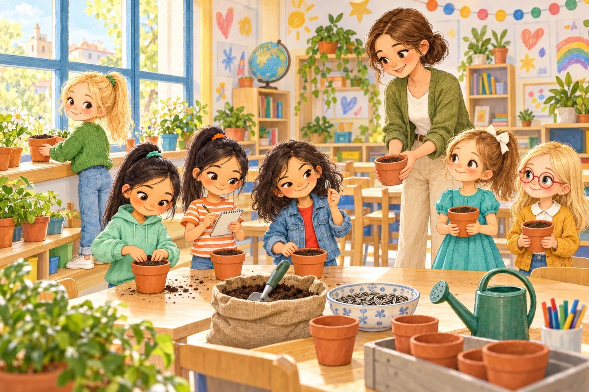
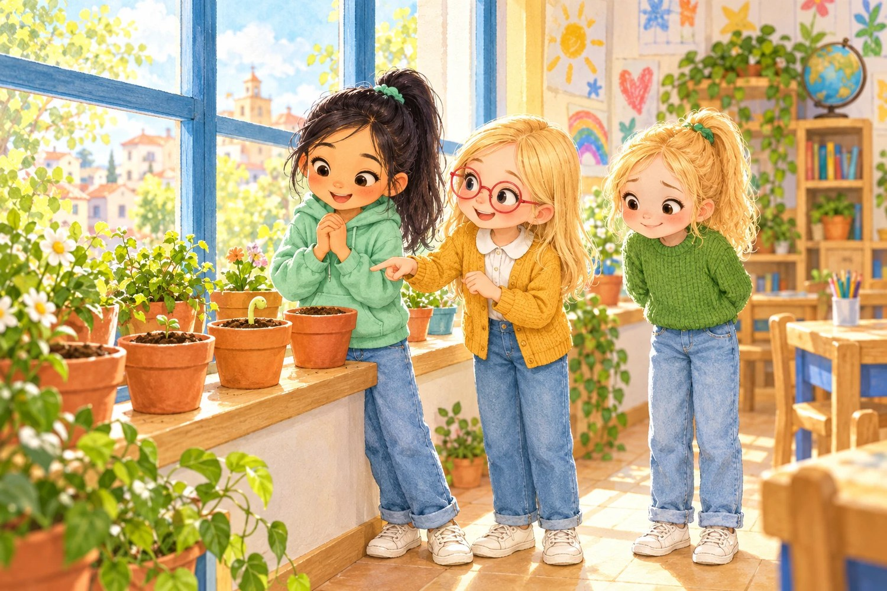
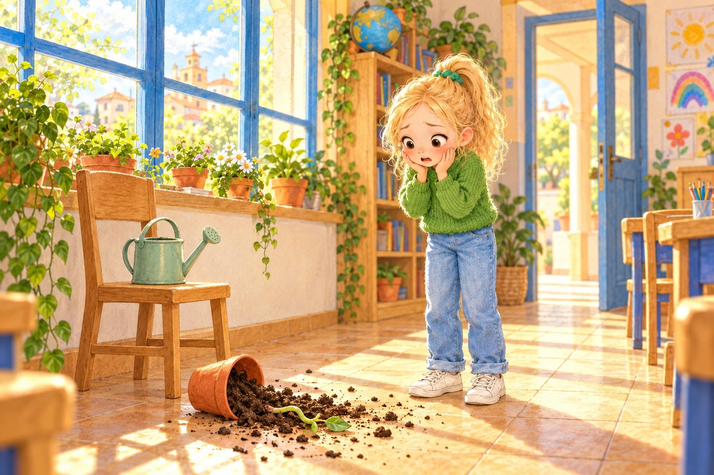
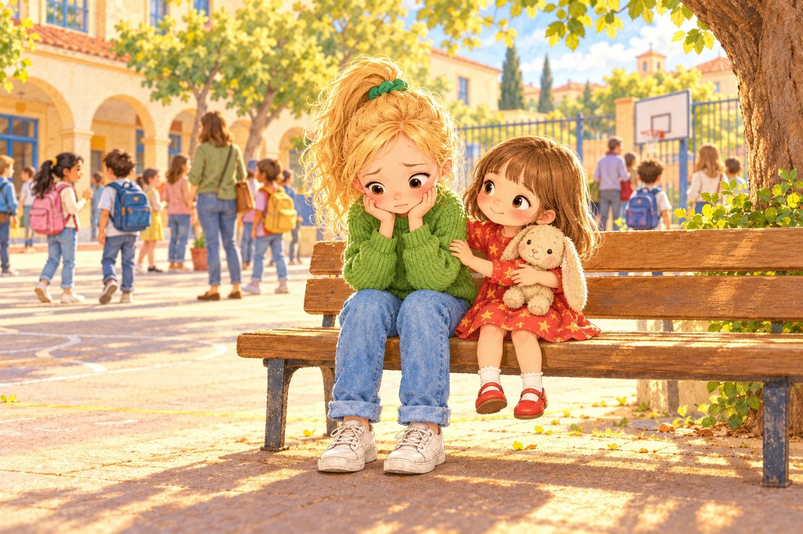
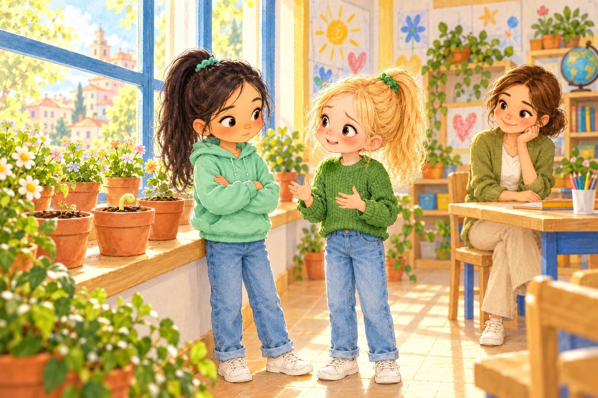
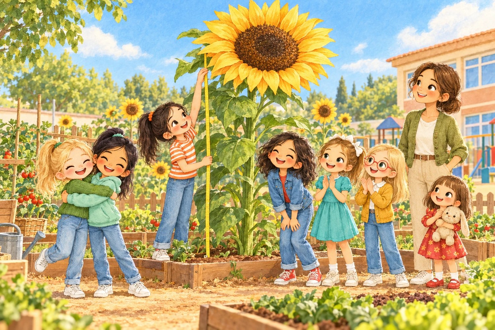

# El girasol de las dos

> ⏱️ Lectura: unos 15 minutos · 🌍 Tema: las plantas y decir la verdad · 👧 Protagonistas: Olivia, Lucía, Sofía B, Sofía V, Jana, Olaya y Liliana

---

## 1. Una semilla para cada una

El lunes, la seño Marta entró en clase con una caja de cartón llena de macetas pequeñas.

—Este trimestre vamos a hacer un huerto —anunció—. Cada uno va a plantar una semilla de girasol y la va a cuidar en la ventana de la clase. En primavera, las plantas que crezcan bien las pasaremos al huerto del patio.

Toda la clase se puso a hablar a la vez. La seño fue repartiendo las macetas, un puñado de tierra y una semilla a rayas blancas y negras para cada uno.

—¡Pero si es una pipa! —dijo Sofía V, y le dio la vuelta como si buscara la trampa.

—Es que las pipas son las semillas del girasol —explicó Olaya, colocándose las gafas rojas—. Las que comemos están tostadas y ya no pueden crecer. Esta está cruda, y dentro tiene una planta entera dormida, esperando.

En la clase había dos Sofías. Para no liarse, todo el mundo las llamaba con una letra detrás: Sofía B, la de la coleta negrísima y la libreta siempre en la mano, y Sofía V, la del pelo un poco rizado y las bromas.

—Pues yo voy a ponerle nombre a mi semilla —dijo Sofía V—. Se va a llamar Pipa Grande.

—Y la mía, Pipa Pequeña —dijo Sofía B, y lo apuntó en la libreta.

Olivia puso su maceta en la ventana, justo al lado de la de Lucía. Lucía era la más cuidadosa de la clase. Apretaba la tierra con la punta de los dedos, sin prisas, como si estuviera arropando a un bebé.

—Ya verás —le dijo Olivia—. El mío va a ser el más alto de todos.

—El mío no tiene prisa —sonrió Lucía—. Con que crezca, me vale.

## 2. Lo que pasa debajo de la tierra

Pasaron cuatro días y en las macetas no pasaba nada. Olivia las miraba cada mañana nada más llegar. Tierra, tierra y más tierra.

—A lo mejor está rota —dijo el jueves—. A lo mejor me ha tocado una semilla estropeada.

—No está rota —le explicó Olaya—. Está trabajando, pero por debajo. Primero la semilla se hincha con el agua. Luego le sale una raíz que va hacia abajo, a buscar agua y sujetarse bien. Y solo después sale el tallo hacia arriba, a buscar la luz. Lo que pasa es que eso no se ve.

El viernes, Lucía llegó corriendo a la ventana y soltó un gritito. En su maceta asomaba un gancho verde clarito, doblado como un signo de interrogación.

—¡Ha salido!

Toda la clase se acercó a mirarlo. La seño Marta dijo que era el primer brote del curso y Sofía B lo apuntó en su libreta con fecha y todo. Jana le hizo un dibujo. Sofía V propuso hacerle una fiesta.

Olivia miró su maceta. Tierra. Ni un gancho, ni un puntito verde, nada.

—Enhorabuena —le dijo a Lucía.

Y lo dijo de verdad, pero por dentro sintió un pinchacito pequeño y feo, como cuando a otra le toca la pegatina que tú querías.

## 3. Un viernes por la tarde

Esa tarde, a Olivia le tocaba regar las plantas. Era la última de la clase. Las demás ya estaban en el pasillo poniéndose los abrigos.

Llenó la regadera, se subió a la silla para llegar mejor a la ventana y empezó a regar, maceta por maceta. Al estirarse hacia la del final, el codo le dio un golpe a la de Lucía.

La maceta se tambaleó, se inclinó y cayó al suelo. ¡Plof!

Olivia se bajó de un salto. La tierra se había esparcido por las baldosas y el brote verde, el gancho que tanto habían celebrado, estaba partido por la mitad.

Se quedó helada. Escuchó voces en el pasillo y el corazón se le aceleró. Muy deprisa, sin pensar, metió la tierra en la maceta con las manos, colocó el brote roto como pudo, de pie, apoyado contra el borde, y puso la maceta en su sitio, un poco girada para que no se notara.

—¡Olivia, que nos vamos! —gritó Jana desde la puerta.

—¡Ya voy!

Salió con la cara roja y no dijo nada a nadie.

Todo el fin de semana tuvo una sensación rarísima en la tripa, como si se hubiera tragado una piedra. Jugó con Liliana, merendó tortitas, vio una película… y la piedra seguía ahí. Cada vez que se acordaba del brote partido, pesaba un poquito más.

## 4. Una piedra en la tripa

El lunes, Lucía fue directa a la ventana. Olivia vio desde su mesa cómo se le borraba la sonrisa.

—Mi girasol… —dijo bajito—. Está roto.

Todas se acercaron. Sofía B dijo que a lo mejor había sido el viento. Sofía V dijo que a lo mejor había sido un fantasma vegetariano, pero nadie se rio. Jana le pasó a Lucía un pañuelo. Lucía no lloraba, pero tenía los ojos brillantes y no dejaba de mirar el tallo partido.

—No pasa nada —dijo al final, muy bajito—. Total, yo ya no planto más.

Olivia abrió la boca. La cerró. No le salía nada.

A la salida, mientras esperaban a mamá, Liliana se sentó a su lado en el banco del patio con Peluso en brazos.

—¿Por qué estás tan callada?

Y Olivia, que llevaba tres días sin contárselo a nadie, se lo contó todo a su hermana pequeña. Lo de la regadera, el codo, el ¡plof!, y cómo había escondido el brote roto.

Liliana se quedó pensando un rato, balanceando los pies.

—¿Te acuerdas de cuando rompí tu taza de unicornio?

—Sí.

—Te lo dije yo. Y te enfadaste un poquito. Pero luego se te pasó. Y a mí se me quitó la piedra de la tripa.

Olivia se quedó mirándola.

—¿Tú también tenías una piedra?

—Una enorme —dijo Liliana, abriendo mucho los brazos—. Así de grande.

## 5. La verdad, aunque cueste

El martes, Olivia llegó al cole antes que nadie. Esperó junto a la ventana con las manos sudadas. Cuando entró Lucía, respiró hondo, como antes de tirarse a la piscina.

—Lucía, tengo que decirte una cosa. Lo de tu girasol… fui yo. Le di con el codo al regar, se cayó y se rompió. Y lo escondí. Lo siento muchísimo.

Lucía se quedó muy quieta.

—¿Y por qué no me lo dijiste?

—Porque me dio miedo. Y vergüenza. Y cuanto más tardaba, más miedo me daba.

Lucía frunció el ceño. Se dio la vuelta y se fue a su mesa sin decir nada. A Olivia se le encogió el estómago. Pero, curiosamente, la piedra pesaba un poco menos.

La seño Marta, que lo había oído todo desde su mesa, se acercó despacio.

—Romper algo sin querer le pasa a cualquiera —le dijo—. Lo difícil es lo que has hecho ahora. Eso es ser valiente.

En el recreo, Lucía vino a buscarla.

—Estaba enfadada —dijo—. Un poco todavía. Pero prefiero que me lo hayas dicho.

Entonces Olivia miró su propia maceta y dio un salto. Por fin, esa misma mañana, de su tierra había salido un gancho verde, doblado como un signo de interrogación.

—Lucía —dijo, sin pensarlo dos veces—. Si quieres, este puede ser el girasol de las dos. Tú lo cuidas mejor que nadie.

Lucía sonrió por primera vez desde el lunes.

—Vale. Pero lo regamos juntas. Y con cuidado de no dar codazos.

## 6. Más alto que la seño

Durante semanas regaron el girasol de las dos cada mañana. Le daban la vuelta a la maceta un poquito cada día, porque Olaya les había explicado que los girasoles jóvenes van girando la cabeza para seguir al sol, y si no, se torcían hacia la ventana.

En primavera lo plantaron en el huerto del patio, junto a Pipa Grande y Pipa Pequeña, que al final también habían salido.

El girasol de las dos creció y creció. Primero les llegó a la rodilla, luego a la nariz y un día, a principios de junio, Sofía B lo midió con una cinta métrica y apuntó en su libreta, muy seria:

—Más alto que la seño Marta.

La flor era enorme, amarilla por fuera y marrón por dentro. Olaya les contó que esa parte marrón no era una flor, sino cientos de flores diminutas apretadas, y que cada una se convertiría en una pipa.

—O sea, que dentro de nuestro girasol hay cientos de girasoles esperando —dijo Lucía.

—Y cientos de pipas para Garbanzo —añadió Jana.

Sofía V propuso hacerle una fiesta. Esta vez, todas dijeron que sí.

Al final de curso, cuando recogieron las pipas, Lucía le dio la mitad a Olivia en una bolsita de papel.

—Para que el año que viene plantemos otro —le dijo—. Y si se cae, me lo cuentas.

—Te lo cuento —prometió Olivia.

Y aquella vez no tuvo que pensárselo ni un segundo.

---

> ### 🌟 Moraleja
>
> **Decir la verdad cuesta un momento; callarla pesa todos los días.**
> Equivocarse le pasa a cualquiera. Lo valiente es reconocerlo y arreglarlo, aunque dé miedo.

---

### 🌻 Lo que aprendimos sobre las plantas

| Dato | Explicación |
|---|---|
| Las pipas son semillas | Dentro de cada pipa cruda hay una planta dormida. Las tostadas ya no pueden crecer. |
| Primero, la raíz | La semilla se hincha con agua, saca una raíz hacia abajo y después el tallo hacia arriba, buscando la luz. |
| Los girasoles siguen al sol | Cuando son jóvenes, van girando la cabeza a lo largo del día para mirar hacia el sol. |
| Una flor hecha de flores | El centro marrón del girasol son cientos de florecitas. Cada una se convierte en una pipa. |

**Pregunta para después de leer:** ¿alguna vez te ha costado decir la verdad? ¿Cómo te sentiste después de decirla?
